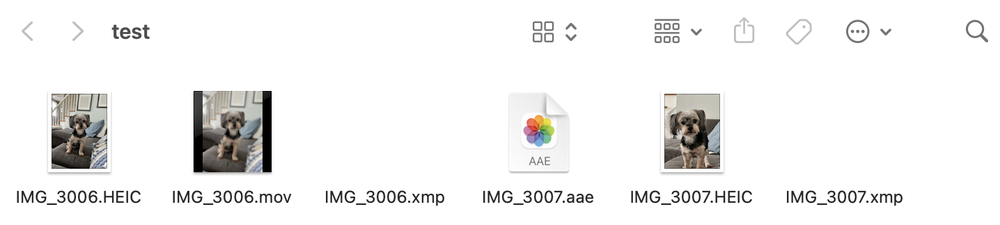

# PhotoLibraryTools
### Python script for managing imports/exports for Apple Photos

This is a small but useful script that I made to help manage and streamline the organization of exports from Apple Photos. This script can...

* Read a photo library directory
* __Recognize associated metadata and .mov files (live photos)__ and __group__ them together in separate folders
* __Ungroup__ image folders to bring all files to the root directory
* Fix naming errors in __.aae__ files

### Disclaimer
__Only use this script on backups and/or copies of your personal photo libraries.__ Edge cases have not been properly tested, and any errors or interruptions during execution may result in the loss of data. ___Use at your own risk___.

### Usage
`[python3 | py] main.py <path/to/photolib> [folders | ungroup | print]`

### Examples

Unmodified exports of two photos from Apple Photos.

Running `print` and `folders` commands.

Results of the `folders` command (can be undone with `ungroup`).
